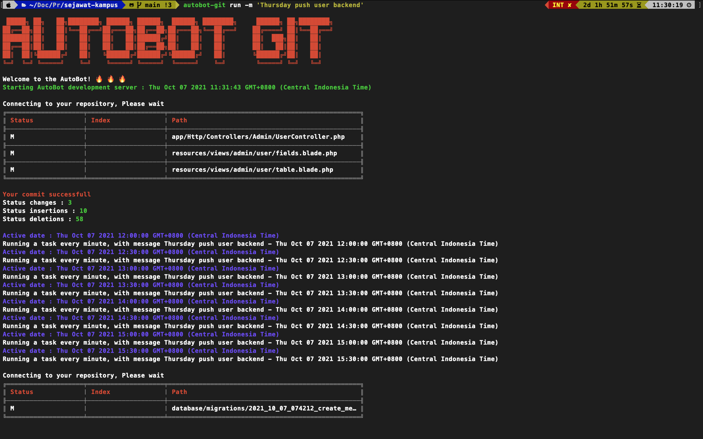

▶️ autobot-git
=========
[](https://badge.fury.io/js/autobot-git)
[](https://app.travis-ci.com/kabesma/autobot)

This you utility for private repository and you work alone, 
because this is simple git and only work git add, commit, pull, and push automatic

<p align="center">
    
</p>

## Table of contents

- [Installation](#installation)
- [Usage](#usage)
- [Examples](#examples)
- [License](#license)

## Installation

```
npm install -g --save autobot-git
```

## Usage

### Help
```bash
 █████╗ ██╗   ██╗████████╗ ██████╗ ██████╗  ██████╗ ████████╗     ██████╗ ██╗████████╗
██╔══██╗██║   ██║╚══██╔══╝██╔═══██╗██╔══██╗██╔═══██╗╚══██╔══╝    ██╔════╝ ██║╚══██╔══╝
███████║██║   ██║   ██║   ██║   ██║██████╔╝██║   ██║   ██║       ██║  ███╗██║   ██║
██╔══██║██║   ██║   ██║   ██║   ██║██╔══██╗██║   ██║   ██║       ██║   ██║██║   ██║
██║  ██║╚██████╔╝   ██║   ╚██████╔╝██████╔╝╚██████╔╝   ██║       ╚██████╔╝██║   ██║
╚═╝  ╚═╝ ╚═════╝    ╚═╝    ╚═════╝ ╚═════╝  ╚═════╝    ╚═╝        ╚═════╝ ╚═╝   ╚═╝

Welcome to the AutoBot! 🔥 🔥 🔥
Usage: autobot-git [options] [command]

Options:
  -h, --help      display help for command

Commands:
  run [options]   Use run for autobot
  test [options]  Use testing function
  help [command]  display help for command
```
### run
```bash
Use run for autobot

Options:
  -m, --message <string>  Add message with optional type
  -h, --help              display help for command
```
## Examples
```bash
autbot-git run
```

### Custom value renderer
```bash
autbot-git run -m 'This is autobot-git push'
```

## License 

[MIT](https://github.com/cyrilwanner/autobot-git/blob/master/LICENSE)
(MIT License)

Copyright (c) 2010 LearnBoost &lt;muhammad@akil.co.id&gt;

Permission is hereby granted, free of charge, to any person obtaining
a copy of this software and associated documentation files (the
'Software'), to deal in the Software without restriction, including
without limitation the rights to use, copy, modify, merge, publish,
distribute, sublicense, and/or sell copies of the Software, and to
permit persons to whom the Software is furnished to do so, subject to
the following conditions:

The above copyright notice and this permission notice shall be
included in all copies or substantial portions of the Software.

THE SOFTWARE IS PROVIDED 'AS IS', WITHOUT WARRANTY OF ANY KIND,
EXPRESS OR IMPLIED, INCLUDING BUT NOT LIMITED TO THE WARRANTIES OF
MERCHANTABILITY, FITNESS FOR A PARTICULAR PURPOSE AND NONINFRINGEMENT.
IN NO EVENT SHALL THE AUTHORS OR COPYRIGHT HOLDERS BE LIABLE FOR ANY
CLAIM, DAMAGES OR OTHER LIABILITY, WHETHER IN AN ACTION OF CONTRACT,
TORT OR OTHERWISE, ARISING FROM, OUT OF OR IN CONNECTION WITH THE
SOFTWARE OR THE USE OR OTHER DEALINGS IN THE SOFTWARE.

